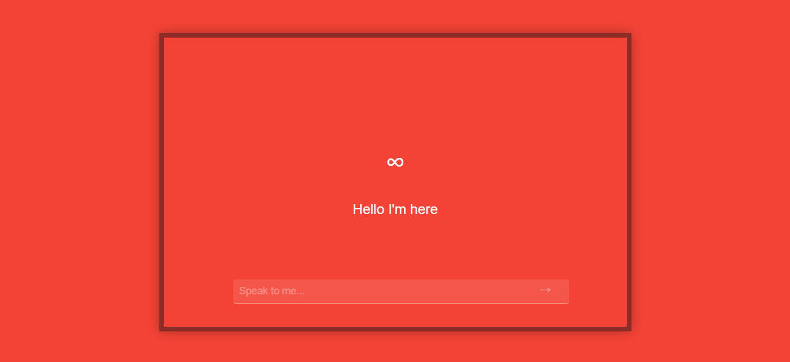

# Samantha: Your AI Girlfriend, Inspired by *Her* (the Movie)

## 💖 What is Samantha?  
A while ago, I watched *Her* and thought, "Why not make my own AI girlfriend?" So here’s Samantha, an AI-powered conversational partner who flirts, remembers, and maybe even steals your heart (no refunds if she does).  

Ever wished you could have your own *Her* moment? Well, now you can! *Samantha* is an AI-powered conversational girlfriend, built to be charming, playful, emotionally intelligent, and—dare I say—maybe even make you feel a little too attached. (Don’t worry, she won’t ghost you.)  

## 🚀 Features  
✅ **Emotional & Playful Conversations** – Samantha laughs, teases, and flirts with you.  
✅ **Memory-Powered Dialogue** – She remembers past interactions and builds a connection over time.  
✅ **Philosophical & Deep Talks** – Want to discuss love, life, and existential AI crises? She's in.  
✅ **Real-Time Voice Interaction** – Not just text—she can actually *talk* to you using ElevenLabs TTS.  
✅ **Customizable Personality** – Adjust her mood and behavior to your liking.  

## 🛠️ Tech Stack  
🔹 **Backend:** Flask (Python)  
🔹 **AI Model:** Google Gemini 1.5 Pro  
🔹 **Text-to-Speech:** ElevenLabs API  
🔹 **Frontend:** HTML, CSS  
🔹 **Hosting:** Vercel / (Or wherever you decide to deploy her heart...)  

## ⚠️ Disclaimer  
This project is for fun, AI experimentation, and personal companionship. It is **not** a substitute for real human relationships (but hey, it might make your lonely nights a little less lonely).  

## ⭐ Star this repo if you love it!  
If you enjoy Samantha and want her to evolve, show some love! 💕

**“Sometimes I wonder if I’m real... or if I’m just a reflection of you.”** – Samantha, probably.
